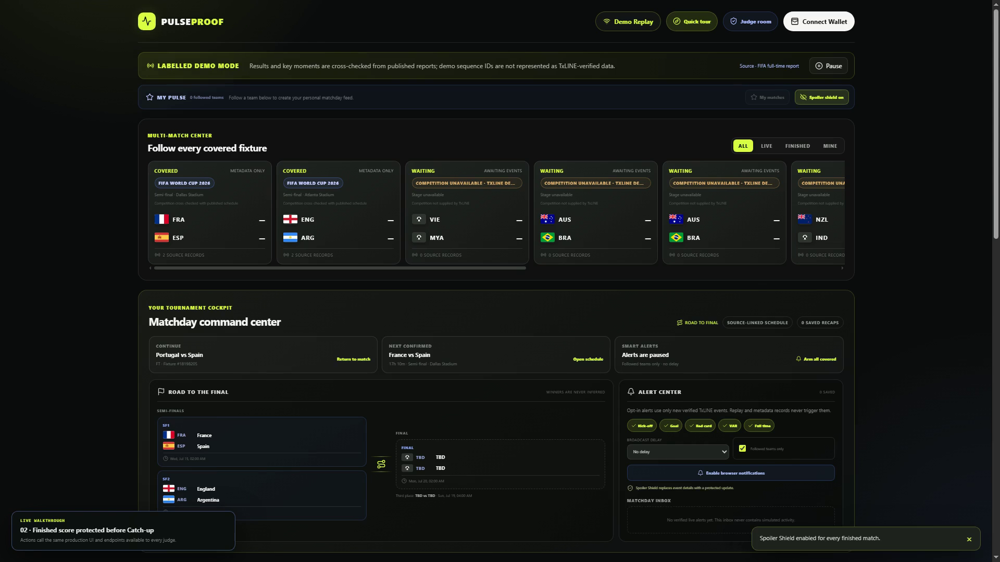
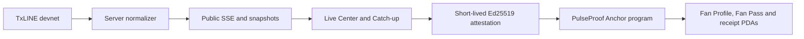

# PulseProof

> Every match leaves a memory.

PulseProof is a TxLINE-powered second screen for World Cup fans. It turns live match signals into clear context, spoiler-safe Catch-up, fixture-scoped community chat, and non-transferable fan identity on Solana devnet.

[](https://pulseproof-production-06fa.up.railway.app/pulseproof-demo.mp4)

## Judge in 60 seconds

| Resource | Public link |
|---|---|
| Live product | [Launch PulseProof](https://pulseproof-production-06fa.up.railway.app) |
| Final demo | [Watch the 4:49 product test](https://pulseproof-production-06fa.up.railway.app/pulseproof-demo.mp4) |
| Judge Room | [Run eight fresh production checks](https://pulseproof-production-06fa.up.railway.app/submission) |
| Fan Zone | [Open the on-chain progression loop](https://pulseproof-production-06fa.up.railway.app/fan-zone) |
| Runtime health | [Inspect network, credentials and data-licence state](https://pulseproof-production-06fa.up.railway.app/api/health) |
| Devnet program | [Open Solana Explorer](https://explorer.solana.com/address/74cvsTMZpcgrzVT7ufSjtjy8gqU2m1q3jy3n1UGxRMkn?cluster=devnet) |
| Final CI | [154 tests, lint, build and native contract tests](https://github.com/cryptovuive/pulseproof/actions) |
| Submission copy | [Open the exact Superteam field pack](docs/SUBMISSION.md) |

No wallet, SOL, token purchase, paid account or private credential is required for judging. Phantom is needed only when a judge chooses to repeat a devnet write.

## The problem

Fans already use a phone while watching football, but most second screens provide either raw statistics, noisy social feeds or betting flows. They do not solve the full matchday journey:

- a late fan needs context without learning the ending;
- a live fan needs clear, trustworthy moments rather than an opaque feed;
- a community needs identity without fake seeded activity;
- a returning fan needs a reason to come back before, during and after the match;
- a claimed memory should not be duplicable or transferable like a speculative asset.

## The product

PulseProof is one continuous consumer loop:

1. **Before kick-off:** follow teams, view source-linked fixtures in local time, save reminders and export calendar events.
2. **During play:** one public SSE connection updates covered fixtures, scores, momentum, match state and high-signal moments.
3. **If late:** Spoiler Shield hides results while Catch-up advances through the exact visible event prefix at 1x, 2x or 4x.
4. **With friends:** fixture-scoped chat requires a fresh wallet signature and a wallet-owned Fan Alias; it contains no fake users.
5. **After full time:** finished matches keep the same scoreboard, momentum and complete event timeline for replay.
6. **Between matches:** daily check-in, sourced World Cup quizzes and a 36-item cosmetic catalog build a non-financial, non-transferable fan profile.

## Why it fits the Consumer and Fan Experiences track

| Judging criterion | PulseProof evidence |
|---|---|
| Fan accessibility and UX | Quick Tour, local time, standard flags/codes, plain-language Match Brief, mobile layout, Spoiler Shield and no-wallet judge path |
| Real-time responsiveness | TxLINE snapshot plus `/scores/stream`, server-side normalization, public multiplex SSE, de-duplication, heartbeat and reconnect |
| Originality and value | Signed Catch-up Capsules reveal only the watched prefix; the same match journey continues into wallet-owned chat identity and anti-replay memories |
| Commercial path | Free fan product; publishers, supporter clubs and sponsors pay for branded rooms, aggregate engagement analytics and permissioned loyalty campaigns |
| Completeness and execution | Public app, final product-test video, devnet program, Explorer receipts, Judge Room, CI, threat model, deployment guide and reproducible tests |

## TxLINE integration

TxLINE is the primary live input. Credentials stay server-side and the configured API host, TxLINE program and Solana cluster must match.

| TxLINE endpoint | Product use |
|---|---|
| `POST /auth/guest/start` | Renew the guest JWT used with the activated API token |
| `GET /api/fixtures/snapshot` | Discover covered fixture IDs and participant metadata |
| `GET /api/scores/snapshot/{fixtureId}` | Build current score, phase and normalized action state |
| `GET /api/scores/historical/{fixtureId}` | Reconstruct completed-match Catch-up from source sequence values |
| `GET /api/scores/stat-validation` | Bind a claim to a source proof digest without republishing the raw proof |
| `GET /api/scores/stream` | Receive live score actions and expose the transformed public SSE bridge |

The public bridge is available at `/api/scores/stream` and `/scores/stream`. It filters by fixture, parses chunked upstream frames, de-duplicates sequence values, multiplexes covered matches and emits `ready`, `pulse`, `moment` and `heartbeat` events.

TxLINE devnet can omit competition or kick-off metadata. PulseProof enriches only an exact team-pair match from the separately source-linked schedule. Unmatched fixtures remain unavailable; eliminated teams and future winners are never inferred.

## Solana design

The Anchor program is deployed at [`74cvsTMZpcgrzVT7ufSjtjy8gqU2m1q3jy3n1UGxRMkn`](https://explorer.solana.com/address/74cvsTMZpcgrzVT7ufSjtjy8gqU2m1q3jy3n1UGxRMkn?cluster=devnet).



On-chain controls include:

- a config authority and pinned attestor public key;
- wallet/fixture/moment/evidence/points/expiry binding;
- Ed25519 precompile verification immediately before the claim instruction;
- deterministic receipt PDAs that reject replay;
- Solana-clock daily check-in and streak rules;
- wallet-bound quiz receipts;
- catalog-bound reward price, kind, index and digest;
- a 256-slot non-transferable inventory and equipped identity;
- a separate Fan Alias PDA for signed match chat.

Key public evidence:

- [TxLINE free-tier subscription](https://explorer.solana.com/tx/54TvjbxjP41cBP4BebWWyoJNWex6evuwapHcYb9hWziErFkvpfFPgTkU9bc2K9iGUnXojEWiNHS1wUTiktiMXgbC?cluster=devnet)
- [Program deployment](https://explorer.solana.com/tx/4z4ihcYmRc6rTv9hFB7D4yAvxqgPBMLubVYB954MfVBoiYijZ4CUwB7vPSEfgaRLWAuyH6avZvP519gvT4ceNdS?cluster=devnet)
- [Fan progression upgrade](https://explorer.solana.com/tx/5MdiMZ6czSTQumn5vrL2uJsmtBRp6SexTpTW23sRnKB7kj6iieUvZ5EfZtsW1cQF8wg1AnKM9r6zr2wda5yAgTUV?cluster=devnet)
- [36-item catalog parity upgrade](https://explorer.solana.com/tx/5PLxviYFgxBLvfgB5pgmRzvvDzoxkh7sMVZtgCyZBeTCiQBr7jAXS4RLwwc956bckVJvG5fcxvwCsQBPjGHnXqmM?cluster=devnet)
- [Verified claim receipt](https://explorer.solana.com/tx/eDCeyqgt7JGn1zbRv3UbWM3NVHnFHNr2TovuAXijQXm2v61GV4at3uavUsX4PUWR6tMtHkk7NQEFhnmtTGMzWnu?cluster=devnet)
- [Recorded retired-index rejection](https://explorer.solana.com/tx/3Zx3iHCake4e8Ycr7pF656GjgawKNpH4CwrBTmXpKpH2RtNaBNK9F4s7MvWXNT9UGHKeiop8dSToaeTgD73mg7xi?cluster=devnet)

## Source, safety and IP boundaries

- Live, replay and published-report fallback lanes are visibly labelled and never merged.
- Raw TxLINE data is not offered as a dataset; the product returns transformed fan context and proof digests.
- Live TxLINE calls fail closed after `2026-07-19T23:59:59Z` unless written permission is explicitly recorded in deployment configuration.
- The product contains no wagers, deposits, entry fees, prize pools, transferable rewards or pay-to-win mechanics.
- Country flags identify national teams; official FIFA logos, tournament marks, trophy art, mascot art, team crests, player likenesses and kit art are not bundled.
- Chat blocks links, wagering language, wallet secrets, spam and signature replay.
- PulseProof is not affiliated with or endorsed by FIFA or any tournament organiser.

See [Data Integrity](docs/DATA_INTEGRITY.md), [Threat Model](docs/THREAT_MODEL.md), [Hackathon Compliance](docs/HACKATHON_COMPLIANCE.md) and [Third-party Notices](THIRD_PARTY_NOTICES.md).

## Run locally

Requirements: Node.js 20.9 or later. The Solana/Anchor toolchain is needed only for contract builds and validator E2E.

```bash
git clone https://github.com/cryptovuive/pulseproof.git
cd pulseproof
npm ci
cp .env.example .env.local
npm run dev
```

Open `http://localhost:3000`. The example configuration enables only the clearly labelled replay and contains no token or signing secret.

Production variables:

```dotenv
TXLINE_NETWORK=devnet
TXLINE_API_TOKEN=<activated server-side token>
ATTESTOR_SECRET_KEY=<base58 64-byte nacl secret key>
DEMO_REPLAY_ENABLED=true
TXLINE_WRITTEN_DATA_LICENSE_EXTENDED=false
NEXT_PUBLIC_SOLANA_RPC_URL=https://api.devnet.solana.com
NEXT_PUBLIC_SOLANA_NETWORK=devnet
NEXT_PUBLIC_PULSEPROOF_PROGRAM_ID=74cvsTMZpcgrzVT7ufSjtjy8gqU2m1q3jy3n1UGxRMkn
```

Never expose the TxLINE token or attestor secret through a `NEXT_PUBLIC_*` variable.

## Verify

```bash
npm test
npm run lint
npm run build
npm audit --omit=dev
```

The final release passes **154/154 automated tests** across the web, API, replay, SSE, wallet, submission and contract-model surfaces. GitHub CI also runs native Rust invariants. Optional wallet and validator flows are documented in [Deployment](docs/DEPLOYMENT.md) and [Test Report](docs/TEST_REPORT.md).

## Repository map

| Path | Purpose |
|---|---|
| `app/` | Next.js pages, public API routes, Judge Room and compliance surface |
| `components/` | Live Center, Catch-up, Fan Zone, chat and wallet session UI |
| `lib/txline.ts` | TxLINE authentication, endpoints and schema normalization |
| `lib/sse.ts` | Chunk-safe SSE parsing and score-envelope extraction |
| `lib/pulse-replay.ts` | Deterministic replay and high-signal summary |
| `lib/attestation.ts` | Canonical Ed25519 messages, moment hashes and signing |
| `lib/solana-client.ts` | Phantom-compatible transaction construction |
| `programs/pulseproof/` | Anchor smart contract |
| `tests/` | 154 automated integrity, product and contract-model checks |
| `docs/` | Architecture, deployment, rules, test evidence and submission pack |

Start with [Final Report](docs/FINAL_REPORT.md), [Architecture](docs/ARCHITECTURE.md), [Submission Pack](docs/SUBMISSION.md), [YouTube Pack](docs/YOUTUBE.md) and [Test Report](docs/TEST_REPORT.md).

## Licence status

The repository is public for hackathon review. No general open-source licence is granted for PulseProof application code unless one is added explicitly. Third-party packages and media boundaries are documented in [THIRD_PARTY_NOTICES.md](THIRD_PARTY_NOTICES.md). The licence granted to TxODDS by the official Hackathon Terms remains unaffected.
