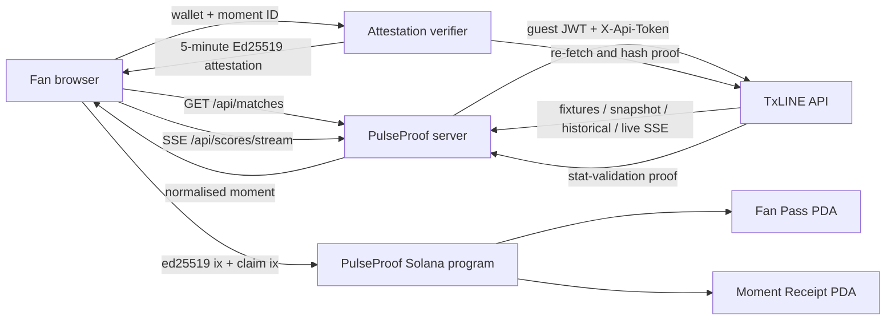

# Architecture and trust model



## Trust boundaries

1. TxLINE is the upstream sports-data authority. Its credential never reaches the browser.
2. The PulseProof attestor decides which UI moment maps to points/badge. Its public key is pinned in the on-chain config PDA.
3. Solana's Ed25519 precompile verifies the signature. The PulseProof program checks that this verification instruction is immediately before `claim_moment` and that the exact public key and canonical message match.
4. The program does not trust client-authored points, badge, wallet, fixture or expiry because every field is included in the signed message.
5. A receipt PDA makes duplicate claims fail at account creation.

## Canonical attestation

UTF-8 bytes:

```text
PULSEPROOF_V1|<wallet>|<fixture_id>|<moment_hash_hex>|<evidence_hash_hex>|<points>|<badge>|<expires_at>
```

`moment_hash = sha256(fixtureId|seq|txlineAction|occurredAt)`.

`evidence_hash = sha256(source|moment_hash|TxLINE_proof_response_digest_or_feed-event)`. This binds the signed claim to the validation evidence used by the server without publishing the raw TxLINE proof.

## Smart-contract accounts

| Account | Seeds | Key fields |
|---|---|---|
| `PulseConfig` | `config` | authority, 32-byte attestor key |
| `FanPass` | `fan_pass`, owner, fixture ID LE | owner, fixture, check-in, points, badge bitmap, claims |
| `MomentReceipt` | `receipt`, owner, moment hash | fixture, hash, points, badge, claimed time |

## Instructions

- `initialize_config(attestor)` — one-time program configuration.
- `update_attestor(attestor)` — authority-only key rotation.
- `create_match_pass(fixture_id)` — wallet check-in for one fixture.
- `claim_moment(hash, points, badge, expiry)` — Ed25519-gated reward update and anti-replay receipt.

## Failure behaviour

- TxLINE unavailable: live path returns 503 unless labelled replay fallback is enabled.
- Guest JWT expired: server requests a new JWT; the API token remains server-side.
- No active fixture: UI can use historical mode or labelled replay.
- Attestation expired/wrong wallet/wrong attestor/changed points: contract rejects.
- Duplicate moment: receipt PDA already exists, so the transaction fails.
- Contract not deployed: the browser still verifies the attestor signature locally and clearly reports that the devnet write is pending; this is a development fallback, not a successful on-chain claim.

## Multi-match live path

1. `/api/matches` ranks the nearest covered fixtures and exposes at most eight match overviews.
2. The browser opens one `/api/scores/stream?fixtureIds=...` connection instead of one connection per match.
3. The server takes an initial snapshot to establish `lastSeq`, then bridges TxLINE `/scores/stream` directly.
4. Events are filtered by subscribed fixture ID and ignored when their sequence is not newer than `lastSeq`.
5. A 15-second heartbeat keeps intermediaries from buffering or closing an idle match stream.
6. If upstream closes, the bridge reports a non-fatal warning and reconnects after 1.5 seconds.

Catch-up uses the live snapshot for a match in progress and `/scores/historical/{fixtureId}` after full-time. The browser reconstructs score, minute and momentum at an exact event cursor; it never invents events between TxLINE records.

## Data minimisation

- No TxLINE response database.
- No raw proof is returned by the attestation endpoint; only a SHA-256 digest and endpoint/stat-key metadata.
- No wallet profile, email, name or IP address is persisted.
- Fallback results are externally cross-checked and source-linked; their local sequence IDs are never labelled TxLINE-verified.
