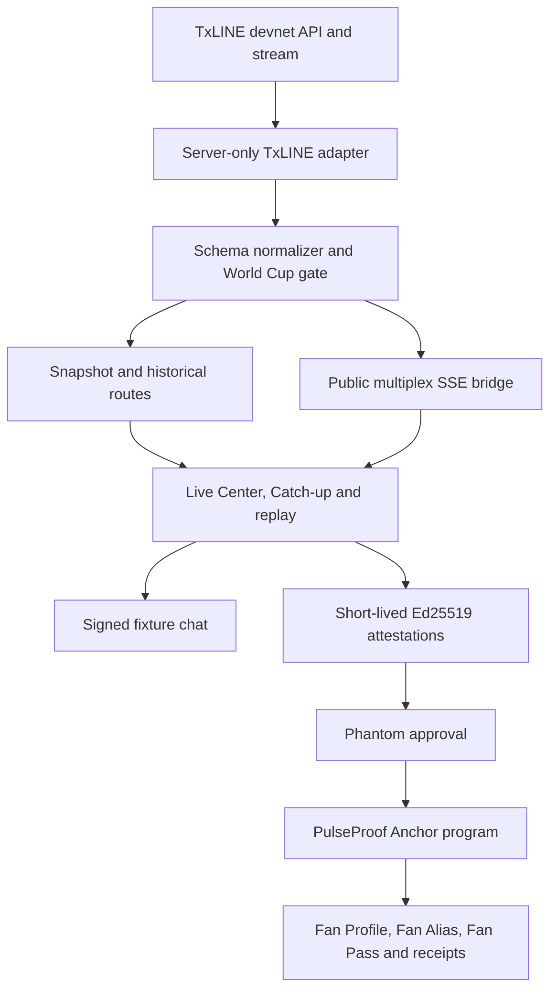

# PulseProof final technical and product report

**Track:** TxODDS Consumer and Fan Experiences  
**Release date:** 19 July 2026  
**Live app:** https://pulseproof-production-06fa.up.railway.app  
**Judge Room:** https://pulseproof-production-06fa.up.railway.app/submission  
**Repository:** https://github.com/cryptovuive/pulseproof  
**Network:** TxLINE devnet and Solana devnet

## 1. Executive summary

PulseProof is a consumer second screen that remains useful before, during and after a World Cup match. It uses TxLINE as the primary live data input, transforms normalized match actions into accessible fan context, and uses Solana only where public ownership and replay resistance improve the product.

The core differentiator is a continuous fan-memory loop:

- plan the next match from a source-linked schedule;
- follow multiple covered fixtures through one SSE connection;
- catch up from an exact spoiler-safe event prefix;
- share that prefix as an Ed25519-signed Catch-up Capsule with no future payload;
- join a fixture room with a wallet-owned display name and fresh message signature;
- preserve non-transferable check-in, quiz, reward and match-memory state on Solana.

The final submission is a functional public product, not a mock-up. It includes a 4:49 end-to-end product test, a deployed Anchor program, public Explorer evidence, a Judge Room that runs eight fresh production checks, 154 automated tests, CI, deployment instructions and integrity documentation.

## 2. User problem

Existing football second screens often optimize for experts, betting conversion or generic engagement. A mainstream fan experiences different problems across one matchday:

1. **Before kick-off:** schedules are easy to misread across time zones and knockout participants can change.
2. **During play:** a raw action feed does not explain why a moment matters.
3. **When arriving late:** a final score or complete timeline immediately spoils the match.
4. **In community:** anonymous chat is easy to fake, spam or impersonate.
5. **After full time:** the useful live experience usually disappears into a static result.
6. **Between matches:** financialized rewards are not appropriate for every fan and do not create durable identity.

PulseProof treats those as one product journey instead of unrelated features.

## 3. Product experience

### 3.1 Live Center

- World Cup-only multi-match catalog with standard national-team flags and abbreviations.
- Separate All, Live, Finished and followed-team views.
- Score, match phase, latest signal, momentum and on-pitch event timeline.
- Clear live, replay, fallback and metadata-only source labels.
- Source-linked Road to the Final that never infers future winners.
- Upcoming fixtures in the user's local time with countdown, reminders and calendar export.
- My Pulse follows teams, remembers the last fixture and creates a personal matchday feed.

### 3.2 Spoiler-safe Catch-up and replay

- Spoiler Shield hides finished scores, bracket results, match brief, timeline and final momentum.
- Catch-up advances through the same scoreboard, momentum and timeline used in live coverage.
- Pause, resume, 1x, 2x and 4x controls remain interactive.
- Completed matches retain scorer, assist, card, substitution, VAR and stoppage-time details.
- A Catch-up Capsule commits only the currently visible prefix, signs it, expires it, re-checks the source on redemption and returns zero future-event payload.
- A bounded Offline Recap Pack stores sanitized finished-match context without caching API, SSE or proof responses.

### 3.3 Fan Zone

- One Phantom connection persists between Live Center and Fan Zone.
- Wallet-owned Fan Alias supplies the public match-chat display name.
- Solana-clock daily check-in implements once-per-UTC-day streak behavior.
- Daily five-question quiz draws from 10,000 deterministic World Cup variants; answer keys stay server-side until grading.
- Practice quizzes are unlimited but reward-free.
- Thirty-six original non-transferable medals, badges, frames and characters have fixed catalog indexes, kinds, prices and seasonal availability.
- Redeem and equip update immediately after confirmation and expose an Explorer receipt.

### 3.4 Match community

- Each fixture has an isolated SSE chat room and real presence state.
- No seeded or fake users are displayed.
- Posting requires a fresh Phantom message signature but no transaction fee.
- The server verifies wallet, Fan Alias, fixture, body and replay-protection value.
- Links, wagering language, wallet secrets, duplicate signatures and spam are rejected.
- History is bounded to 50 messages per room for the hackathon deployment.

## 4. TxLINE integration

TxLINE is not a decorative verification badge. It is the live source that drives fixture identity, score state, event order, Catch-up and claim evidence.

| Endpoint | Integration purpose |
|---|---|
| `POST /auth/guest/start` | Obtain and renew guest JWTs while the activated token remains server-side |
| `GET /api/fixtures/snapshot` | Discover covered fixture IDs and participants |
| `GET /api/scores/snapshot/{fixtureId}` | Load the latest score and action envelope |
| `GET /api/scores/historical/{fixtureId}` | Rebuild completed-match source history when available |
| `GET /api/scores/stat-validation` | Produce a source proof digest for eligible moments |
| `GET /api/scores/stream` | Receive score actions for the real-time product |

The integration enforces network consistency:

- devnet API origin: `https://txline-dev.txodds.com`;
- devnet TxLINE program: `6pW64gN1s2uqjHkn1unFeEjAwJkPGHoppGvS715wyP2J`;
- devnet Solana RPC and PulseProof program.

The transformed public stream is available at `/api/scores/stream` and `/scores/stream`. It supports fixture filtering, chunk-safe frame parsing, sequence de-duplication, multiplexing, heartbeat and reconnect. Credentials never enter the browser bundle.

### Sparse-metadata policy

TxLINE devnet can return a covered fixture without authoritative competition, round or kick-off fields. PulseProof never guesses them. It enriches only an exact current participant pair from a separately source-linked World Cup schedule. If the pair cannot be proven, the fixture remains unavailable and is excluded from the World Cup product.

### Replay policy

Historical TxLINE source events are preferred. If a completed historical endpoint is empty while the final TxLINE snapshot contains valid sequenced on-pitch actions, that final snapshot can reconstruct replay. Separately sourced published-report replays are clearly labelled, use non-TxLINE local sequence IDs and never enter the live TxLINE stream.

## 5. Solana program

**Program address:** `74cvsTMZpcgrzVT7ufSjtjy8gqU2m1q3jy3n1UGxRMkn`

Main accounts:

- `Config`: authority and pinned attestor public key;
- `FanPass`: wallet plus fixture match-memory totals;
- `MomentReceipt`: deterministic wallet/fixture/moment replay guard;
- `FanProfile`: points earned/spent, streak, quiz state, inventory and equipped cosmetics;
- `FanAlias`: wallet-owned public display name;
- quiz and reward receipts: single-use, wallet-bound progression proofs.

Critical contract controls:

1. The Ed25519 verification instruction must immediately precede the claim instruction.
2. The signed message binds wallet, fixture, moment hash, evidence digest, points, badge and expiry.
3. Expired or far-future attestations fail.
4. Deterministic receipt PDAs stop the same moment or quiz result from being claimed twice.
5. Reward redemption binds catalog digest, kind, index and price.
6. Overspending, duplicate ownership and kind confusion fail.
7. Retired index `36` and every larger index fail on-chain before inventory mutation.
8. Points and rewards are non-transferable and have no cash or wagering utility.

Public deployment and transaction links are maintained in the [README](../README.md) and [Deployment Guide](DEPLOYMENT.md).

## 6. Architecture

The detailed trust boundaries, message formats and failure modes are in [Architecture](ARCHITECTURE.md) and [Threat Model](THREAT_MODEL.md).

## 7. Data integrity, privacy and safety

- Source lanes are visibly distinct: TxLINE live, TxLINE history/final snapshot, and labelled published-report replay.
- Unsupported statistics are omitted rather than estimated.
- Competition, round, kick-off and future winners are never inferred from a team name alone.
- Server responses expose transformed product context, not a downloadable TxLINE dataset.
- The stat-validation response is reduced to a digest before it is signed.
- Preferences are local-first; chat is bounded and ephemeral in the hackathon deployment.
- Wallet addresses and public aliases are inherently public product identifiers; private keys and seed phrases are never requested.
- API routes apply body bounds, rate limits, no-store cache policy and security headers.
- The service worker excludes API, SSE and attestation paths from cache.
- Live TxLINE access fails closed after the hackathon data-licence window unless written permission is explicitly configured.
- The product contains no betting, deposits, entry fees, prize pools, transferable rewards or financial return claims.

## 8. Brand and third-party IP

PulseProof uses an original product mark, original reward art, MIT-licensed country flags and ISC-licensed interface icons. It does not bundle official FIFA or tournament logos, trophy artwork, mascot artwork, team crests, player photographs, player likenesses or kit art. Source links identify factual match and quiz material without copying source pages as datasets.

Full package notices are in [THIRD_PARTY_NOTICES.md](../THIRD_PARTY_NOTICES.md). PulseProof does not claim sponsorship, affiliation or endorsement by FIFA or a tournament organiser.

## 9. Testing and release evidence

Final automated verification:

- **154/154 tests passed**;
- ESLint passed;
- Next.js production build and TypeScript passed;
- native Rust contract invariants passed in CI;
- runtime dependency audit reported zero known vulnerabilities;
- tracked-secret scan found no token, wallet key or signing key;
- public GitHub Actions passed on the release commit;
- production health, app, Judge Room, video and Explorer links are public.

The suite covers TxLINE normalization, sparse metadata, competition filtering, SSE parsing, replay, spoiler isolation, Catch-up Capsules, PWA boundaries, team branding, schedule reconciliation, chat signature replay, quiz answer non-disclosure, reward catalog parity, transaction models, contract anti-replay and submission assets.

Final video evidence:

- H.264/AAC MP4, 1920x1080, 30 fps;
- duration `289.046440` seconds, below the five-minute limit;
- size `15,490,180` bytes;
- SHA-256 `aa1b22060da889766f0091ff511b39ee27861fe828959e085afd7aead9578e59`;
- English male narration, sentence-level WebVTT captions and public transcript;
- real UI, Phantom devnet approvals, immediate receipts and eight fresh Judge Room checks.

See [Test Report](TEST_REPORT.md) for reproducible commands and detailed coverage.

## 10. Commercial path

The fan-facing product remains free. The business model avoids selling raw TxLINE data or financializing fan points.

Potential customers:

- sports publishers that need a differentiated second screen;
- supporter clubs that need verified member identity and match rooms;
- sponsors that need permissioned non-financial loyalty campaigns;
- broadcasters that need spoiler-safe Catch-up and aggregate engagement signals.

Paid capabilities can include branded rooms, moderation tooling, campaign configuration, aggregate privacy-preserving analytics, white-label deployment and service-level support. A production agreement would require continuing TxLINE data rights, scalable pub/sub for chat/presence, durable moderation and Web Push infrastructure.

## 11. Rules alignment

The final package meets the track's explicit submission requirements:

| Requirement | Evidence |
|---|---|
| Demo video up to five minutes | 4:49 final public product test |
| Problem, app walkthrough and TxLINE backend | Narration, Live Center, replay and Judge Room chapters |
| Working application or API | Public Railway app plus health and SSE routes |
| Public repository | `cryptovuive/pulseproof` |
| Functional, not a mock-up | Product writes, public program, Explorer receipts and fresh production checks |
| TxLINE live input and Solana sign-up | Activated devnet subscription, snapshot/stream integration and program deployment |
| Technical documentation | This report, architecture, deployment, threat model and test report |
| TxLINE feedback | Exact copy is prepared in [Submission Pack](SUBMISSION.md) |
| Free judge access | Replay, Judge Room, CI and Explorer require no wallet or payment |

The registered participant must still confirm personal eligibility, accurate team information and the final Superteam form submission.

## 12. Objective self-assessment

This is an internal readiness estimate, not a promise of placement.

| Criterion | Score | Reason |
|---|---:|---|
| Fan accessibility and UX | 19/20 | Polished full-journey experience, mobile and spoiler controls; onboarding depth remains high for first-time users |
| Real-time responsiveness | 18/20 | Real TxLINE stream, public SSE, heartbeat and source replay are implemented; the final video does not depend on a live goal occurring during recording |
| Originality and value creation | 20/20 | Prefix-safe signed Catch-up plus non-transferable fan identity is materially different from a generic score feed |
| Commercial and monetization path | 18/20 | Credible B2B2C path without betting or data resale; no signed customer validation yet |
| Completeness and execution | 19/20 | Public product, contract, video, CI and documentation are complete; chat/pub-sub and Web Push need production infrastructure |
| **Total** | **94/100** | Submission-ready with clearly bounded post-hackathon work |

No responsible assessment can guarantee a top-three result because competitor quality and judge preference are unknown.

## 13. Remaining participant actions

1. Upload the final MP4 to YouTube using [YouTube Pack](YOUTUBE.md).
2. Insert the public YouTube URL in [Submission Pack](SUBMISSION.md).
3. Optionally publish an X launch post and add its URL.
4. Verify every link in a private/incognito browser.
5. Confirm eligibility and team information truthfully.
6. Submit personally before the deadline.

## 14. Conclusion

PulseProof demonstrates that verified sports data can power more than a score widget or betting flow. TxLINE provides the live match truth, the consumer layer turns it into accessible and spoiler-safe participation, and Solana preserves only the fan actions that benefit from public ownership and replay resistance. The result is a coherent World Cup fan ecosystem that starts before kick-off and remains useful after full time.
